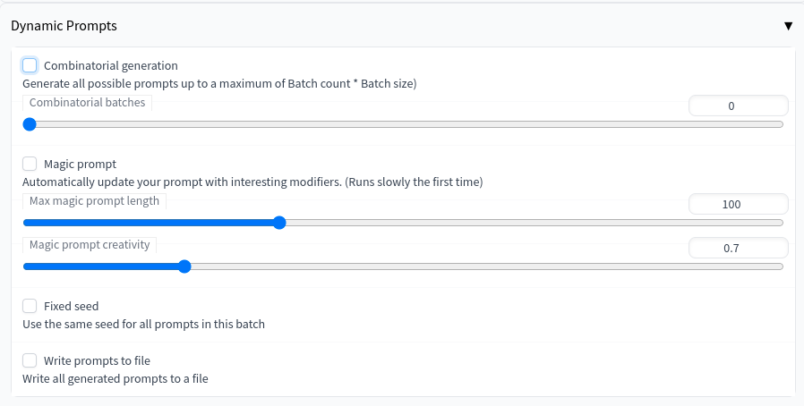
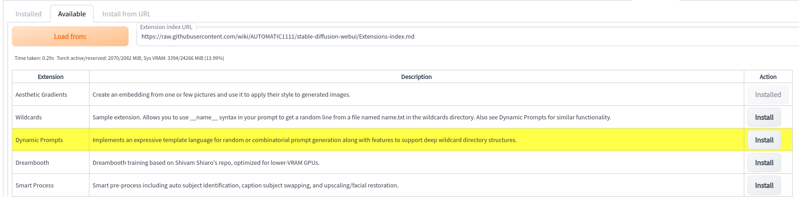
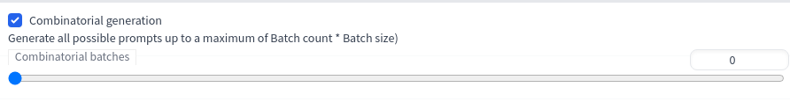
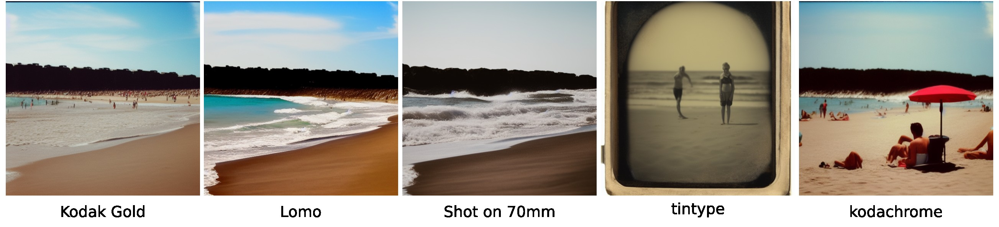
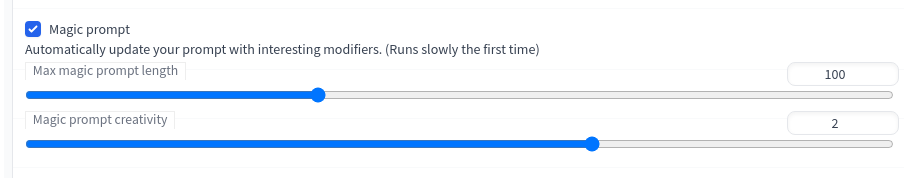
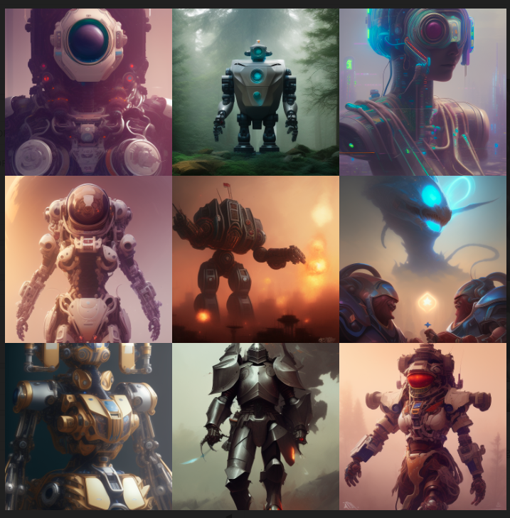
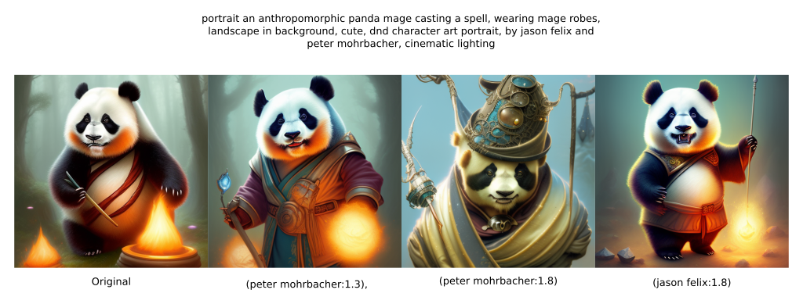
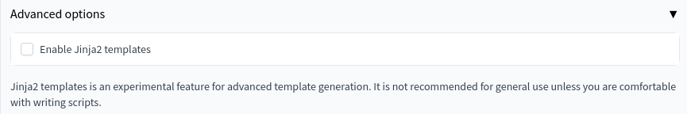

# Stable Diffusion Dynamic Prompts extension 

A custom extension for [AUTOMATIC1111/stable-diffusion-webui](https://github.com/AUTOMATIC1111/stable-diffusion-webui) that implements an expressive template language for random or combinatorial prompt generation along with features to support deep wildcard directory structures.

Using this script, the prompt:

	A {house|apartment|lodge|cottage} in {summer|winter|autumn|spring} by {2$$artist1|artist2|artist3}

Will produce any of the following prompts:

- A **house** in **summer** by **artist1**, **artist2**
- A **lodge** in **autumn** by **artist3**, **artist1**
- A **cottage** in **winter** by **artist2**, **artist3**
- ...

This is especially useful if you are searching for interesting combinations of artists and styles.

You can also pick a random string from a file. Assuming you have the file seasons.txt in WILDCARD_DIR (see below), then:

    __seasons__ is coming

Might generate the following:

- Winter is coming
- Spring is coming
- ...

You can also use the same wildcard twice

    I love __seasons__ better than __seasons__

- I love Winter better than Summer
- I love Spring better than Spring

## Installation

The extension can be installed directly from within the **Extensions** tab within the Webui

You can also install it manually by running the following command from within the webui directory:

	git clone https://github.com/adieyal/sd-dynamic-prompting/ extensions/dynamic-prompts

## Compatible Scripts
Dynamic Prompts works particularly well with the following scripts:
- [randomize](https://github.com/stysmmaker/stable-diffusion-webui-randomize) if you want to randomise non-prompt parameters like steps, width/height, sample, CFG scale, etc. Both scripts can work concurrently.
- X/Y Plot - setting Dynamic Prompts to <a href="#combinatorial-generation">combinatorial mode</a> while using X/Y Plot, lets you exhaustively test prompt and paramter variations simultaneously.

## Template syntax

### Combinations
	{2$$opt1|opt2|opt3}

This will randomly combine two of the options for every batch, separated with a comma.  In this case, "opt1, opt2" or "opt2, opt3", or "opt1, opt3" or the same pairs in the reverse order.

	{1-3$$opt1|opt2|opt3}

This will use a random number of options between 1 and 3 for each batch. 

If the number of combinations chosen is greater than the number of options listed then options may be repeated in the output.
If the number of combinations chosen is less than or equal to the number of options listed then the same options will not be chosen more than once.

	{4$$and$$opt1|opt2|opt3|opt4|opt5}

This will choose 4 options and join them together with 'and' instead of the default comma. When there are multiple $$ tokens then the first item is the number of options to choose and the second option is the joiner to use.
	{-$$opt1|opt2|opt3}

An omitted minimum is assumed to be 0 and an omitted maximum is assumed to be the number of options.

	{opt1|opt2|opt3}
If you omit the $$ prefix, one item will be selected. (Equivalent to 1$$)

Options are chosen randomly with replacement. This means that {2$$opt1|opt2} can return any of the following:
- opt1, opt1
- opt1, opt2
- opt2, opt1
- opt2, opt2

This is useful in conjunction with wildcards (see below).

Options can be assigned relative weights using a :: prefix operator.

	photo of a {3::blue|red} ball

This will generate 3 photos of a blue ball per every 1 photo of a red ball.

	photo of a {blue|0.25::red} ball
	
Decimals also work as expected: this will generate 4 photos of a blue ball per every 1 photo of a red ball.

	photo portrait of a {59::white|21::latino|14::black|8::asian} {man|woman}

This would generate photo portraits of men and women of different races, proportional to the 2020 U.S. census.

If you omit the :: prefix, it will have a default weight of 1.0. (Equivalent to 1::prompt)

### Wildcard files
Wildcards are text files (ending in .txt). Each line contains a term, artist name, or modifier. The wildcard file can then be embedded in your prompt by removing the .txt extension and surrounding it with double underscores. e.g:

	My favourite colour is __colours__

Empty lines and lines starting with `#` are ignored. This can be used to add comments or disable sections of the file.

Mixing Combinations and Wildcards can be useful. For example,

	a photo of a {2-4$$and$$__adjective__} house

will choose between 2 and 4 options from adjective.txt, join them together with "and", for results such as "a photo of a cozy and ancient and delicate house"

### Nesting
You can nest inside combinations. This means that you can create more advanced templates. For example:

    {__seasons__|__timeofday__}

This will then either choose a season from seasons.txt or a time of day from timeofday.txt.

Combinations can also be nested inside other combinations, e.g. 

    {{a|b|c}|d}

### Recursion
Prompts are processed recursively. If a wildcard file contains a row with dynamic syntax, then that will be resolved as well. For example if seasons.txt contains the following rows:

	Summer
	Winter
	{Autumn|Fall}
	Spring

if the 3rd row is chosen, then either Autumn or Fall will be selected. You could go pretty wild e.g.

	Summer
	__winter_in_different_languages__
	{Autumn|Fall}
	Spring

## Comments
Python and c-style comments are supported:

    Test string
    # This  a comment until the end of the line
    // this is also a comment until the end of the line
    {A|/* this is an inline comment */B}

### Fuzzy Glob/recursive wildcard file/directory matching
In addition to standard wildcard tokens such as `__times__` -> `times.txt`, you can also use globbing to match against multiple files at once.
For instance:

`__colors*__` will match any of the following:
- WILDCARD_DIR/colors.txt
- WILDCARD_DIR/colors1.txt
- WILDCARD_DIR/nested/folder/colors1.txt

`__light/**/*__` will match:
- WILDCARD_DIR/nested/folder/light/a.txt
- WILDCARD_DIR/nested/folder/light/b.txt

but won't match
- WILDCARD_DIR/nested/folder/dark/a.txt
- WILDCARD_DIR/a.txt

You can also used character ranges `[0-9]` and `[a-z]` and single wildcard characters `?`. For more examples see [this article](http://pymotw.com/2/glob/).

## Combinatorial Generation
Instead of generating random prompts from a template, combinatorial generation produced every possible prompt from the given string. For example:
`I {love|hate} {New York|Chicago} in {June|July|August}`

will produce:
- I love New York in June
- I love New York in July
- I love New York in August
- I love Chicago in June
- I love Chicago in July
- I love Chicago in August
- I hate New York in June
- I hate New York in July
- I hate New York in August
- I hate Chicago in June
- I hate Chicago in July
- I hate Chicago in August

If a `__wildcard__` is provided, then a new prompt will be produced for every value in the wildcard file. For example:
`My favourite season is __seasons__`

will produce:
- My favourite season is Summer
- My favourite season is August
- My favourite season is Winter
- My favourite season is Sprint

You also arbitrarily nest combinations inside wildcards and wildcards in combinations.

Combinatorial generation can be useful if you want to create an image for every artist in a file. It can be enabled by checking the __Combinatorial generation__ checkbox in the ui. Note, __num batches__ changes meaning. With random generation, exactly __num_batches__ * __batch_size__ images are created. With combinatorial generation, at *most* __num_batches__ * __batch_size__ images are created. This upper limit ensures that you don't accidentially create a template that unexpectedly  produces thousands of images.

Combinations are not yet supported, i.e. `{2$$a|b|c}` will treat `2$$a` as one of the options instead of selecting two of a, b and c.

### Combinatorial Batches
The combinatorial batches slider lets you repeat the same set of prompts a number of times with different seeds. The default number of batches is 1.

### Increasing the maximum number of generations
By default, the __Batch count__ silder of  automatic1111 has a maximum value of 100. This can limit the maximum number of generations when using combinatorial generation. You can change the maximum value of this slider by editing ui-config.json and change:

	txt2img/Batch count/maximum": 100

to something larger like:

	txt2img/Batch count/maximum": 1000

## Fixed seed
Select this if you want to use the same seed for every generated image. If there are no wildcards then all the images will be identical. It is useful if you want to test the effect of a particular modifier. For example:

	A beautiful day at the beach __medium/photography/filmtypes__

That way you can isolate the effect of each film type on a particular scene. Here are some of the results:

## Magic Prompt
Using [Gustavosta](https://huggingface.co/Gustavosta/MagicPrompt-Stable-Diffusion)'s MagicPrompt model, automatically generate new prompts from the input. Trained on 80,000 prompts from [Lexica.art](lexica.art), it can help give you interesting new prompts on a given subject. Here are some automatically generated variations for "dogs playing football":

> dogs playing football, in the streets of a japanese town at night, with people watching in wonder, in the style of studio ghibli and makoto shinkai, highly detailed digital art, trending on artstation

> dogs playing football, in the background is a nuclear explosion. photorealism. hq. hyper. realistic. 4 k. award winning.

> dogs playing football, in the background is a nuclear explosion. photorealistic. realism. 4 k wideshot. cinematic. unreal engine. artgerm. marc simonetti. jc leyendecker

This is compatible with the wildcard syntax described above.

The first time you use it, the model is downloaded. It is approximately 500mb and so will take some time depending on how fast your connection is. It will also take a few seconds on first activation as the model is loaded into memory. Note, if you're low in VRAM, you might get a Cuda error. My GPU uses less than 8GB by YMMV.

You can control the maximum prompt length with the **Max magic prompt length** slider. **Magic prompt creativity** can adjust the generated prompt but you will need to experiment with this setting.

## I'm feeling lucky
Use the [lexica.art](https://lexica.art) API to create random prompts. Useful if you're looking for inspiration, or are simply too lazy to think of your own prompts. When this option is selected, the prompt in the main prompt box is used as a search string. For example, prompt "Mech warrior" might return:

* A large robot stone statue in the middle of a forest by Greg Rutkowski, Sung Choi, Mitchell Mohrhauser, Maciej Kuciara, Johnson Ting, Maxim Verehin, Peter Konig, final fantasy , 8k photorealistic, cinematic lighting, HD, high details, atmospheric,
* a beautiful portrait painting of a ( ( ( cyberpunk ) ) ) armor by simon stalenhag and pascal blanche and alphonse mucha and nekro. in style of digital art. colorful comic, film noirs, symmetry, brush stroke, vibrating colors, hyper detailed. octane render. trending on artstation
* symmetry!! portrait of a robot astronaut, floral! horizon zero dawn machine, intricate, elegant, highly detailed, digital painting, artstation, concept art, smooth, sharp focus, illustration, art by artgerm and greg rutkowski and alphonse mucha, 8 k

Leaving the prompt box blank returns a list of completely randomly chosen prompts.

## Attention grabber
This option randomly selects a keyword in your prompt and adds a random amount of emphasis. Below is an example of how this affects the prompt:

	a portrait an anthropomorphic panda mage casting a spell, wearing mage robes, landscape in background, cute, dnd character art portrait, by jason felix and peter mohrbacher, cinematic lighting

Tick the __Fixed seed__ checkbox under __Advanced options__ to see how emphasis changes your image without changing seed.

## Write prompts to file
Check the write prompts to file checkbox in order to create a file with all generated prompts. The generated file is a slugified version of the prompt and can be found in the same directory as the generated images, e.g. outputs/txt2img-images

## Jinja2 templates
[Jinja2 templates](https://jinja.palletsprojects.com/en/3.1.x/templates/) is an experimental feature that enables you to define prompts imperatively. This is an advanced feature and is only recommended for users who are comfortable writing scripts.

To enable, open the advanced accordion and select __Enable Jinja2 templates__.

You can read about them in more detail <a href="jinja2.md">here</a>

## WILDCARD_DIR
The extension looks for wildcard files in WILDCARD_DIR. The default location is /path/to/stable-diffusion-webui/extensions/sd-dynamic-prompts/wildcards. It can also be manually defined in the main webui config.json under wildcard_dir. When in doubt, the help text for the extension in the webui lists the full path to WILDCARD_DIR

## Collections
The collections directory contains modifier libraries that you can use as is or to bootstrap your own. Copy the collection that you want to use into the wildcards directory. Note, in previous versions, the collections were stored in the wildcards directory. This has now changed so that your own collections don't get clobbered every time you want to update the extension.
There are currently two collections:

- jumbo
- parrotzone

Jumbo is a very large collection of wildcards across many categories including aesthetics, appearance, artists, medium, style, and time. It is a work in progress, but aims to provide good coverage of various modifier categories. 

Parrotzone is a far smaller and more manageable collection sourced from https://proximacentaurib.notion.site/e28a4f8d97724f14a784a538b8589e7d?v=42948fd8f45c4d47a0edfc4b78937474.

If you're using a Unix/Linux O/S, you can easily create a symlink to the relevant collection rather than copying it across if you don't plan to alter it. E.g.

	ln -sr collections/parrotzone wildcards/

## Contributing
If you're interested in contributing to the development of this extension, here are some features I would like to implement:

1. **Saved templates** - [publicprompts.art](https://publicprompts.art/) produces great prompt templates. e.g. 

> Funky pop Yoda figurine, made of plastic, product studio shot, on a white background, diffused lighting, centered

You can swap out Yoda for anything to create a great character. If I create/discover a great prompt that can be turned into a template, it would be great to have a place to save it. The extension could provide some initial templates. Users could then create and save their own.

2. **Tag-based modifers**. Creating a strict taxonomy of concepts for modifiers is always going to be flawed. Some modifiers fit in multiple categories. It would be better to introduce tags to make it easy to place modifiers in multiple places at once.

3. **Improved modifier management**. The modifier library is a little clunky at the moment. You can find a nested hierarchy of all wildcard files, but it isn't possible to see what's in them or even edit them from within the interface. It might be best to implement this in a separate tab.

4. **Improve the modifier library**. I'm currently creating the library from multiple sources but building taxonomies is hard, especially if you're not a domain expert. The photography section is a good example, there are wildcard files for lighting, filetypes, camera models, perspective, photo websites, etc. Someone with a better understanding of photography might have a better way to divide this. The artists section in particular needs some TLC.

5. **Option tweaking**. There have been a few requests for option tweaking like XY Plot. I'm not sure that that is in scope for this extension, but it would be nice to see if we could find a solution that leverage's XY Plot.

6. **Improved UI**. The current UI works, but a few javascript tweaks could improve the user experience tremendously.

Let me know if there is anything you would be interested in looking into.
