# Introduction

Constructing good prompts for Stable Diffusion can be difficult, especially if you're trying to learn through trial and error. Dynamic Prompts is an extension for Automatic1111's webui that let's you test dozens or hundreds of prompts at the same time by making tweaks to your base prompt.

Let's see how this works.

# Installation
You can easily install the extension directly from the Automatic1111 webui's extension tab.

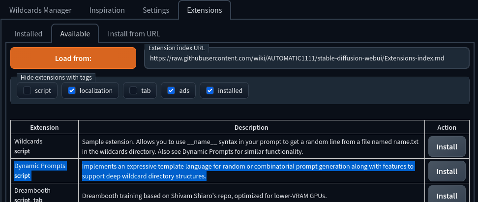

Once you have it installed, you will see a section on your txt2img tab that looks like this:

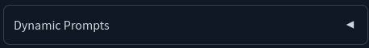

You can see the various options by click on it:

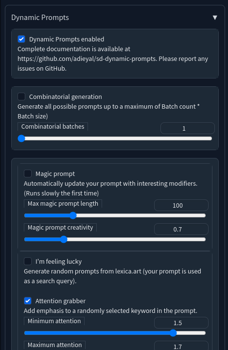<br>


# Getting Started
Suppose you want to create images of a diamond ring, you might start with something like:

    A diamond ring on a gold band.

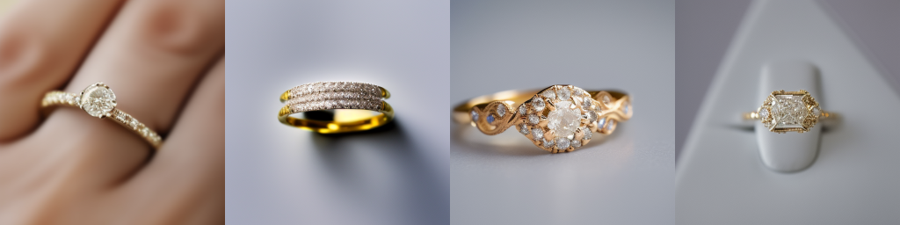

## Variants

What if we wanted an image of a platinum ring as well? We can using Dynamic Prompts variant syntax, e.g.

    A diamond ring set on a {gold|platinum} band.


If we enter this into the prompts box with Dynamic Prompts installed, the generated prompt would be one of:

    A diamond ring set on a gold band

and

    A diamond ring set on a platinum band

## Nested variant

Gold comes in various varieties, let's add those as well:

    A diamond ring set on a {{rose|yellow|white} gold|platinum} band.


Notice how we nested a variant for the type of gold, i.e. `{rose|yellow|white}` inside the main variant. So now, when generating an image, one of the following prompts is created:

    A diamond ring set on a rose gold band
    A diamond ring set on a yellow gold band
    A diamond ring set on a whilte gold band
    A diamond ring set on a platinum band

Nesting variants can quickly make your prompt template hard to read. Luckily, Dymamic Prompts ignores whitespace so that we can change the prompt to:

    A diamond ring set on a {
        {rose|yellow|white} gold   # you can also add comments
        | platinum                 # which will be ignored by the DP parser
    } band

Of course, we're not limited to only one variant, we can add a little more variation like this:

    A {diamond|ruby|emerald} ring set on a {classic|thin|thick}
    {
        {rose|yellow|white} gold
        | platinum
    }
    band

This template could produce any of these prompts:

    A ruby ring set on a classic rose gold band
    A emerald ring set on a thin platinum band
    etc.


That second prompt isn't grammatically correct, it doesn't really matter to Stable Diffusion, but if you prefer correct grammar, you can write something like:

    {A diamond|A ruby|An emerald} ring set on a {classic|thin|thick}
    {
        {rose|yellow|white} gold
        | platinum
    }
    band


### Here are the results for diamond rings:

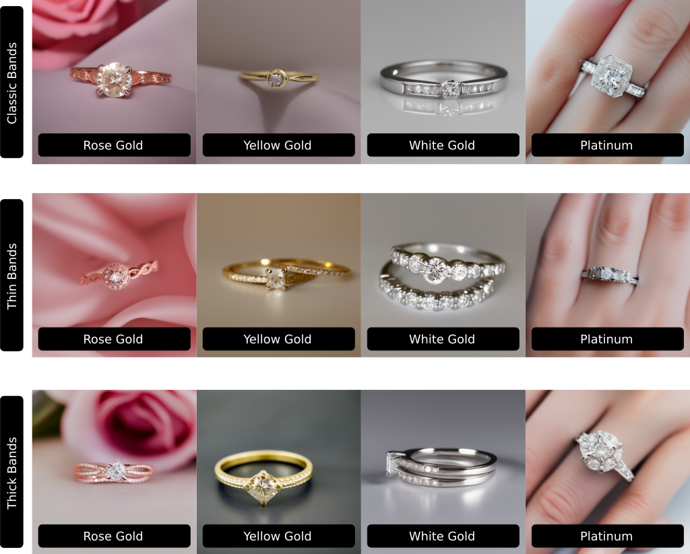<br><br>

### Ruby rings:

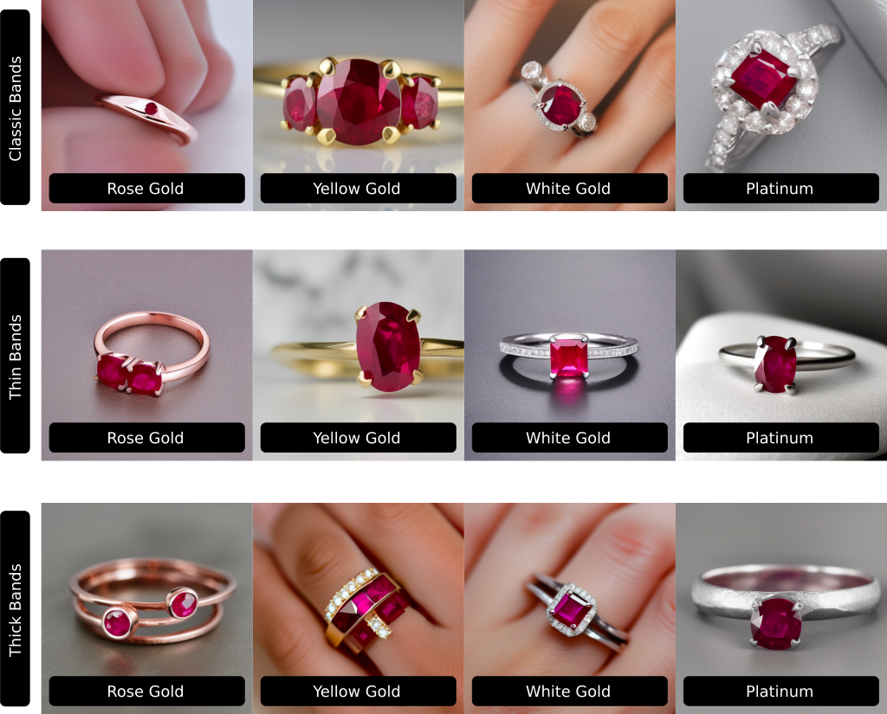<br><br>

### Emerald rings:

<br><br>

## Wildcards

What if we had a large number of gems that we would like to use in our rings? You can certainly add them as variants along with rubies and emeralds, but this may become cumbersome with a large number of variants. In this case we can use a wildcard.

First, we create a file called gems.txt
In it we add one variant per line, e.g.

```
# gems.txt
diamond
ruby
emerald
...
```

We place this file inside the extension's wildcard folder. This can be found in extensions/sd-dynamic-prompts/wildcards

Now our prompt changes to:

    A __gems__ ring set on a {classic|thin|thick}
    {
        {rose|yellow|white} gold
        | platinum
    }
    band

`__gems__` is a wildcard and will act as a variant the uses every gem in gems.txt. Note, the name of the wildcard is the same as the name of the file, i.e. gems.txt without the .txt at the end. We then add a double underscore `__` to the beginning and end of the wildcard.

Neat!

Wildcard files can use all the same syntax that we can use in our prompts. To demonstrate this, let's create a new file called precious_metals.txt. Inside we add:

```
# precious_metals.txt
{rose|yellow|white} gold
platinum
silver
```

Move the file into the wildcards folder. Now our prompt looks like this:

    A __gems__ ring set on a {classic|thin|thick} __precious_metals__ band

## Combinatorial Generation

By default Dynamic Prompts generates random prompts from our template. For each prompt, it will choose a random gem, random band type, and random precious metal. Let's count the total number of possible rings our template can generate:

    Assume we have 10 different types of gems in our gems.txt file
    3 band thicknesses
    3 metals, although gold has 3 variants so we actually have 5 metals.

    The total number of potential prompts is  10 * 3 * 5 = 150 different prompts.

What if we wanted to generate all of them? In that case we change to combinatorial mode.

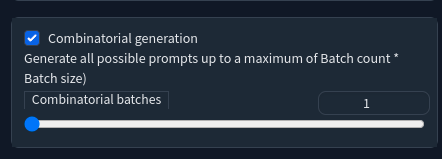

In combinatorial mode, `batch count` is interpreted differently. In random mode, `batch count` represented the total number of prompts to generate, in combinatorial mode, it means _AT MOST_ 10 prompts.

If our template was simply `A diamond ring set on a {gold|platinum} band`, then regardless of what we set batch count to, Dynamic Prompts will only generate two prompts. On the other hand if your `gems.txt` and `precious_metals.txt` files were very long, say 50 gems and 20 metals, you could then generate 1000 different prompts. The reason for setting the upper bound is to prevent accidentally generating far more prompts than you expect.

## Wildcard Collection
A well-designed wildcard collection can be used as building blocks for creating great prompts, without having to reinvent the wheel everytime. Dynamic Prompts provides a large library of wildcards that you can either use wholesale, or pick and choose files that you're interested in. You can see these collections in the Wildcards Manager tab. Of course, you can create your own wildcard files and place them in the wildcards directory.

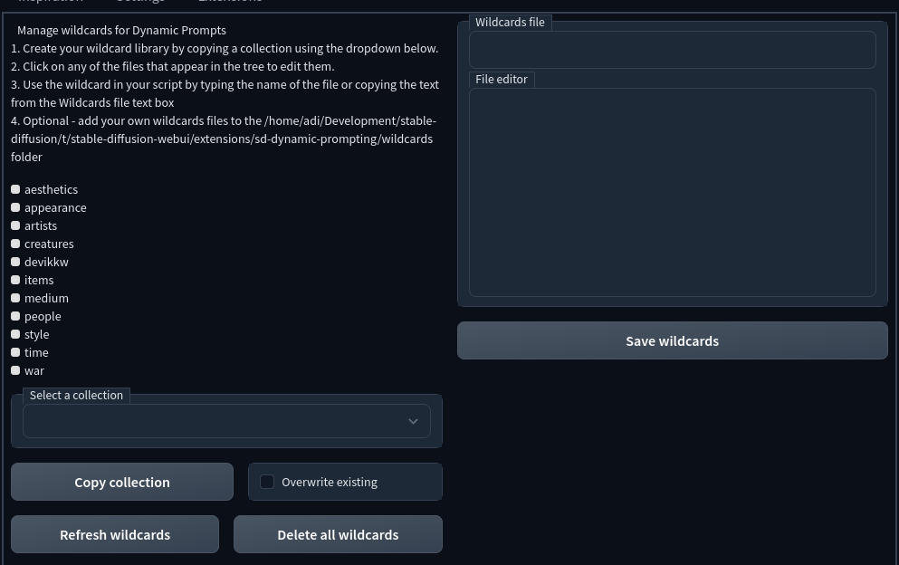

The most interesting wildcards are those related to art and artists. It's a great way to explore different styles. Wildcards are stored in a directory hierarchy. Click on a subject area to discover more specific wildcard files:

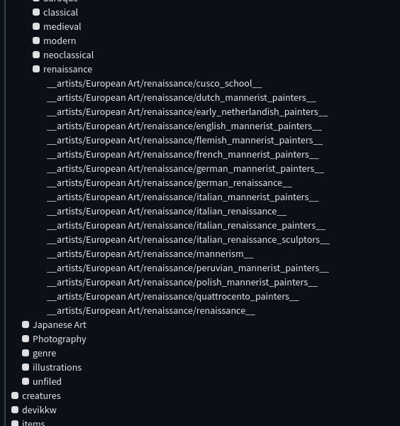<br><br>

You can copy any wildcard from here and use it in your prompts, e.g. `__artists/European Art/renaissance/italian_renaissance__`

If you like to experiment with styles from multiple artists at the same time, try something like:

    surfer in space, intricate detail, airbrush painting, illustration, by __artists/European Art/modern/pointilism__ and __artists/European Art/modern/american_impressionism__

Here are some prompts that I get:

    surfer in space, intricate detail, airbrush painting, illustration, by Vincent van Gogh and Daniel Garber

    surfer in space, intricate detail, airbrush painting, illustration, by Maximilien Luce and Wilson Irvine

    surfer in space, intricate detail, airbrush painting, illustration, by Jean Metzinger and John Elwood Bundy


Dynamic Prompts has syntax to allow you to choose two artists together:

    surfer in space, intricate detail, airbrush painting, illustration, by {2$$__artists/illustrations/childrens_books__}


Some examples of prompts that are generated:

    surfer in space, intricate detail, airbrush painting, illustration, by Todor Dinov,Ray Goossens

    surfer in space, intricate detail, airbrush painting, illustration, by Emily Winfield Martin,Kitty Crowther

    surfer in space, intricate detail, airbrush painting, illustration, by Fritz Wegner,Dawu Yu


The default separator is a `,` - if you prefer to use `and` then change the prompt like this:

    surfer in space, intricate detail, airbrush painting, illustration, by {2$$ and $$__artists/illustrations/childrens_books__}

note the spaces surrounding the `and`.

You don't need to stop at 2, combination syntax allows you to choose any number of artists. For four artists you write it like this:

    surfer in space, intricate detail, airbrush painting, illustration, by {4$$__artists/illustrations/childrens_books__}

You can provide a range, e.g.

    surfer in space, intricate detail, airbrush painting, illustration, by {2-4$$__artists/illustrations/childrens_books__}

Here dynamic prompts will choose 2, 3, or 4 artists.

# Tools for inspiration

## Magic Prompts

When you look at prompts that people post online, you will often notice a number of modifiers related to lighting, resolution, camera type etc. When you're starting out, you might feel overwhelmed by these modifiers. The magic prompt functionality is a fun way to automatically add modifiers to your prompt. You can experiment, but a good way to start is to use a very simple prompt, e.g.

    A mech-warrior in a post-apocalyptic setting.

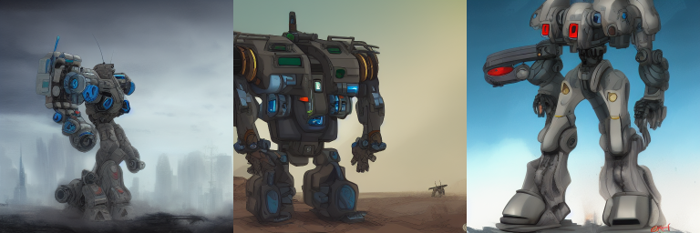

These images are a little plain. Let's jazz them up with Magic Prompts.

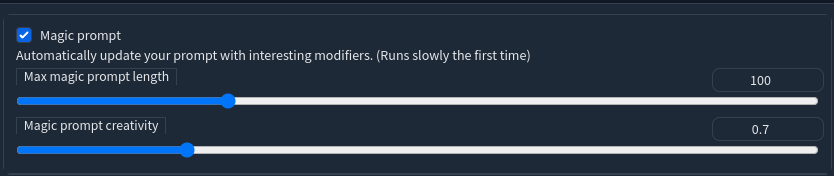

Enable Magic Prompt and click generate. (Note, Magic Prompt uses a neural network add these based on context. The first time you use it, Dynamic Prompts will need to download it which may take some time depending on the speed of your Internet connection.)

Here are some example prompts that I get when using Magic Prompt:

    A mech-warrior in a post-apocalyptic setting. Digital illustration, Artstation. 8k resolution, Concept art, Detailed digital art

    A mech-warrior in a post-apocalyptic setting. Detailed digital art by greg rutkowski, Thomas kinkade, Keith Parkinson, artstation, cgsociety, deviantart, 8k, HD

    A mech-warrior in a post-apocalyptic setting. realistic shaded lighting poster by Ilya Kuvshinov katsuhiro, magali villeneuve, artgerm, Jeremy Lipkin and Michael Garmash, Rob Rey and Kentar� Miura style, trending on art station

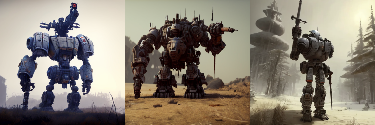

When I have a subject in mind but I'm not yet sure about how I want the final image to look, I usually play around with magic prompt until I find something I like. I then use the generated prompt and tune from there.

## I'm feeling lucky

Another way of getting inspiration is through the I'm feeling lucky function. Instead of using a neural network, I'm feeling lucky uses the search engine on [Lexica.art](http://lexica.art) to find prompts that match your input. Quality may vary, but it is also a fun way to explore the latent space.

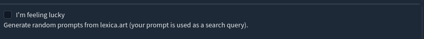

Using `mech-warrior` as my prompt, I get the following:

    giant oversized battle robot mech in battle pose is giant baby on a village, wooden fence and tree remains in far background, hero pose, Cinematic focus, Polaroid photo, vintage, neutral colors, soft lights, foggy, natural mysterous intricate detaild grainy photo, by Steve Hanks, by Serov Valentin, by lisa yuskavage, by Andrei Tarkovsky

    giant oversized battle robot mech as giant baby on a village, Cinematic focus, Polaroid photo, vintage, neutral colors, soft lights, foggy, by Steve Hanks, by Serov Valentin, by lisa yuskavage, by Andrei Tarkovsky

    a detailed manga illustration character full body portrait of a dark haired cyborg anime man who has a red mechanical eye, trending on artstation, digital art, 4 k resolution, detailed, high quality, sharp focus, hq artwork, insane detail, concept art, character concept, character illustration, full body illustration, cinematic, dramatic lighting

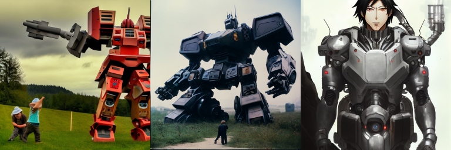

Two points are worth noting.

Firstly, in constrast to Magic Prompt, I'm feeling lucky prompts don't necessary contain our search string. This is because Lexica performs a semantic search on their prompts database. This means that the prompt should be relevant, even if the string doesn't match.

Secondly, if you were to look for this prompt on the Lexica.art website, you wouldn't find the images that were generated. This is because you almost certainly were using different settings to the person who originally crafted the prompt.

## Attention grabber

Another way of adding a touch of variation to your images to by changing emphasis of various terms in the prompt. Attention grabber randomly assigns emphasis to an existing prompt.

Starting with a previous I'm feeling lucky prompt:

    a detailed manga illustration character full body portrait of a dark haired cyborg anime man who has a red mechanical eye, trending on artstation, digital art, 4 k resolution, detailed, high quality, sharp focus, hq artwork, insane detail, concept art, character concept, character illustration, full body illustration, cinematic, dramatic lighting

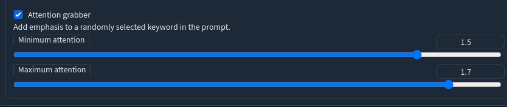

We add randomly add emphasis. For these images, I kept the seed constant so that you can see the impact of changing emphasis without changing any other settings.

    a detailed manga illustration character full body portrait of a dark haired cyborg anime man who has a red mechanical eye, trending on artstation, digital art, 4 k resolution, detailed, high quality, sharp focus, hq artwork, insane detail, concept art, character concept, character illustration, (full body illustration:1.58), cinematic, dramatic lighting

    a detailed manga illustration character full body portrait of a dark haired cyborg anime man who has a red mechanical eye, trending on artstation, digital art, 4 k resolution, detailed, high quality, sharp focus, hq artwork, insane detail, concept art, character concept, character illustration, (full body illustration:1.49), cinematic, dramatic lighting

    a detailed manga illustration character full body portrait of a dark haired cyborg anime man who has a red mechanical eye, trending on artstation, digital art, 4 k resolution, detailed, high quality, sharp focus, hq artwork, insane detail, concept art, character concept, (character illustration:1.26), full body illustration, cinematic, dramatic lighting

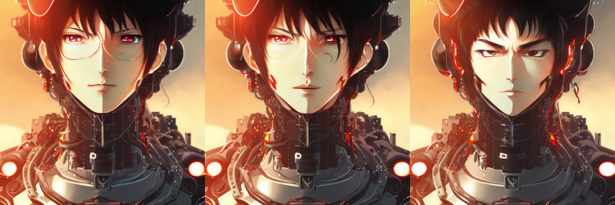

These changes are far more subtle, and can be useful if you want to explore slight changes to your image.

# Conclusion

This tutorial has covered the basics. There are additional features to try out once you feel comfortable using the tool. You can find a list of syntax examples [here](SYNTAX.md). I extension is constantly evolving so make sure to update often. Feel free to ask questions [here](https://github.com/adieyal/sd-dynamic-prompts/discussions) and raise issues [here](https://github.com/adieyal/sd-dynamic-prompts/discussions).

# For developers

Dynamic Prompts was originally developed for Automatic1111. It has recently been split into two separate projects. The Auto1111 extension described here, and the core prompts toolkit which you can find at [https://github.com/adieyal/dynamicprompts](https://github.com/adieyal/dynamicprompts). Dynamic Prompts can be incorporated into your application or colab very easily. Here is an example of Dynamic Prompts being used in the [Deforum 0.7 Colab](https://colab.research.google.com/drive/1qtYHUwFl9ocLyzDRL1_MlpQluV32ndoT)
